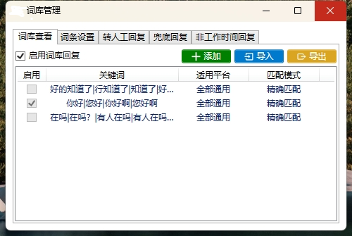

# 快应AI客服

快应AI客服是一个基于 LLM 大语言模型的知识库集成客服系统，提供开箱即用的智能客服解决方案。系统支持多平台对接、文本、语音、图片交互，并通过插件实现对操作系统和互联网等外部资源的访问。

## 项目简介

本项目支持 GPT3.5、GPT4.0、快应AI客服、FastGPT、DifyAI、通义千问、文心一言 等多种大模型，能够处理文本、语音和图片，并支持基于自有知识库定制企业 AI 应用。

## 主要功能

- [√] 多平台支持：支持常用社交平台，未来将不断扩展。
- [√] 预设回复内容：允许用户自定义回复，提高效率。
- [√] 接入 ChatGPT 接口：智能生成回复，处理个性咨询。
- [√] 支持图片及二进制文件发送，满足多样化客服需求。
- [√] 自定义知识库：实现数字分身、智能客服等功能。
- [√] 插件化设计：支持访问操作系统及互联网等外部资源。

## 演示视频
[观看视频](https://www.bilibili.com/video/BV1cU5iz4EEn/?vd_source=31d603176e826c139c53617148a53f8e)

## 功能展示截图

系统提供了以下预览截图，你可以通过点击链接查看详情：

| Demo 1 | Demo 2 |
| ------ | ------ |
|  |  |

| Demo 3 | Demo 4 |
| ------ | ------ |
|  |  |

| Demo 5 | Demo 6 |
| ------ | ------ |
|  |  |

## 项目计划 (RoadMap)

- [ ] 支持微信平台基础聊天功能
- [√] 支持千牛平台基础聊天功能
- [√] 支持京麦平台基础聊天功能
- [√] 添加关闭自动回复功能
- [√] 添加延时随机时间
- [√] 优化各平台独立配置
- [√] 支持 Excel 导入/导出回复内容
- [√] 优化千牛对接模式
- [ ] 优化微信回复速度
- [√] 添加中文路径支持
- [√] 自动检测人类操作暂停项目
- [ ] 新增 wx 群聊@机器人回复功能
- [√] 支持浏览器多开
- [√] 支持导出聊天记录到 Excel
- [ ] 支持关键词匹配测试
- [ ] 实现小红书回复后自动私聊
- [ ] 支持抖音直播自动回复
- [ ] 支持拼多多
- [ ] 支持多平台文章自动发送
- [ ] 支持本地聊天模型加载

## 联系我们

如有问题或建议，请添加小助手微信，并扫描下方二维码进行联系：

